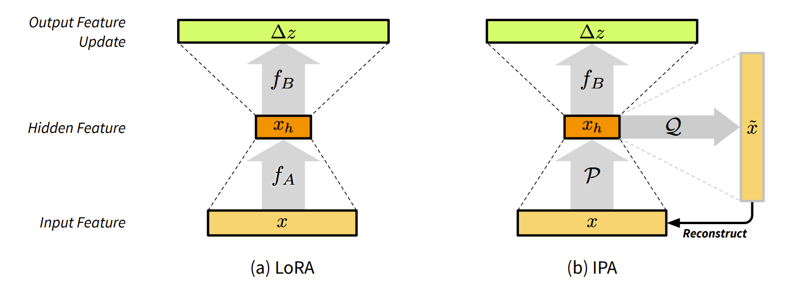

# Official Implementation for IPA

<div align="center">

# IPA: An Information-Reconstructive Input Projection Framework for Efficient Foundation Model Adaptation

**Yuan Yin**$^{1}$, **Shashanka Venkataramanan**$^{1}$, **Tuan-Hung Vu**$^{1}$, **Andrei Bursuc**$^{1}$, **Matthieu Cord**$^{1,2}$

$^{1}$ Valeo.ai    $^{2}$ Sorbonne Université, CNRS, ISIR

[**Paper (TMLR)**](https://openreview.net/forum?id=aLmQeZx2pR)

🏆 **Accepted to TMLR**
<br>
🌟 **Oral and Outstanding Paper Award** at [NeurIPS 2025 CCFM Workshop](https://sites.google.com/view/ccfm-neurips2025)

</div>



-----

## 📖 Abstract

Parameter-efficient fine-tuning (PEFT) methods, such as LoRA, reduce adaptation cost by injecting low-rank updates into pretrained weights. However, LoRA's down-projection is randomly initialized and data-agnostic, discarding potentially useful information. Prior analyses show that this projection changes little during training, while the up-projection carries most of the adaptation, making the random input compression a performance bottleneck. 

We propose **IPA**, a feature-aware projection framework that explicitly preserves information in the reduced hidden space. In the linear case, we instantiate IPA with algorithms approximating top principal components, enabling efficient projector pretraining with negligible inference overhead.

Across language and vision benchmarks, IPA consistently improves over LoRA and DoRA, achieving on average 1.5 points higher accuracy on commonsense reasoning and 2.3 points on VTAB-1k, while matching full LoRA performance with roughly half the trainable parameters when the projection is frozen.

-----

## 🛠️ Installation

This repository is built upon HuggingFace's `peft` package (`v0.13.1`).

```bash
# Clone the repository
git clone https://github.com/valeoai/peft-ipa.git
cd peft-ipa

# Install in editable mode
pip install -e .
```

-----

## 🚀 How to Use IPA

IPA is implemented specifically for `Linear` modules within the PEFT framework. It functions similarly to LoRA but integrates a forward-only training algorithm for the input projection.

### 1\. Basic Usage

You can initialize IPA using the `IPAConfig`.

```python
from peft import get_peft_model, IPAConfig

# Define the IPA Configuration
peft_config = IPAConfig(
    ipa_mode="pre_ipca",  # Select your IPA mode (see below)
    r=32,                  # Rank
    scaling=0.25,
    target_modules=["q_proj", "v_proj"],
    # ... other standard PEFT arguments
)

# Apply to your base model
model = get_peft_model(base_model, peft_config)
```

Before the finetuning step, you can add the pretraining step like this:

```python
# Define the pretraining
if "pre" in peft_config.ipa_mode:
    # Use a subset of training data (e.g., one epoch or a fraction)
    # dataloader = ... (your data loading logic here)

    # Context manager ensures we use base model features without adapter interference
    with model.disable_adapter():
        model.eval()
        with torch.no_grad():
            for batch in tqdm(dataloader, desc="IPA Pretraining"):                
                # The forward pass 
                model(**batch)
```
Please refer to the specific directories for instructions on how to run the pretraining stage followed by the fine-tuning step.

```text
├── commonsense_reasoning/  # Scripts for reasoning tasks
└── vtab/                   # Scripts for Visual Task Adaptation Benchmark
```

### 2\. Implementation Details

  * **Source Code:** The core logic is located in `src/peft/tuners/ipa/layer.py`.
  * **Supported Modules:** Currently, IPA is supported for **Linear** layers.

### 3\. IPA Modes (`ipa_mode`)

You can control the projection behavior using the `ipa_mode` argument in `IPAConfig`.

| Prefix | Description | Available Modes |
| :--- | :--- | :--- |
| **`pre_`** | **Pretraining Stage:** Assumes a pre-calculation step for the projection matrix before fine-tuning. | • `pre_ipca` (Incremental PCA)<br>• `pre_gha` (Generalized Hebbian Algorithm) |
| **`online_`** | **Online Learning:** Assumes forward-only learning happens concurrently during training. | • `online_ipca` (Incremental PCA)<br>• `online_gha` (Generalized Hebbian Algorithm) |

-----

## 📊 Reproducing Benchmarks

We provide the code used for benchmarking IPA on **Commonsense Reasoning** and **VTAB-1k**.

-----

## 📝 Citation

If you use IPA in your research, please cite our TMLR paper:

```bibtex
@article{YinVVBC2025ipa,
    title={{IPA}: An Information-Preserving Input Projection Framework for Efficient Foundation Model Adaptation},
    author={Yuan Yin and Shashanka Venkataramanan and Tuan-Hung Vu and Andrei Bursuc and Matthieu Cord},
    journal={Transactions on Machine Learning Research},
    year={2025},
    url={https://openreview.net/forum?id=aLmQeZx2pR},
}
```

-----

## 🙏 Acknowledgements

We thank the authors of the numerous packages we used to achieve this work, notably:

  * [**`peft`**](https://github.com/huggingface/peft) from HuggingFace.
  * [**`DoRA`**](https://github.com/NVlabs/DoRA) from NVIDIA (which includes benchmark code based on [LLM-Adapters](https://github.com/AGI-Edgerunners/LLM-Adapters)).
  * [**scikit-learn**](https://scikit-learn.org/stable/) from [community contributors](https://github.com/scikit-learn/scikit-learn/graphs/contributors), from which we adapted the `IncrementalPCA` module.
